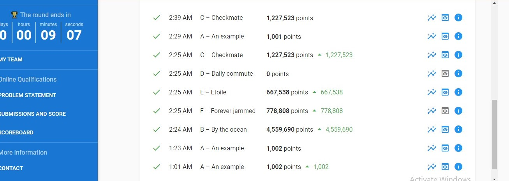
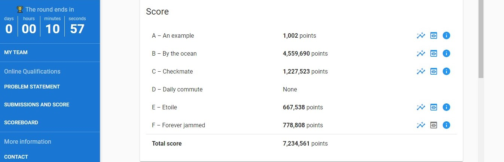

# Google_Hashcode_21

### Who can participate in Google hash code?
One basic criteria they have is age , you should be 16 years and above and for the final round it should be of 18 years and above .
Last but not the least , you should have a knack to solve some real-life based engineering problems selected by Google .
It happens once in every year with two rounds :
* _Online Qualification Round_
* _Final Round_

### My Team's Story :
I participated this year 2021 along with 2 of my friends , we also practiced well the previous year question papers . \n
The whole journey was quite productive and full of new learnings . 
We were able to acheive a World Rank of 5246 with our Rank in India being 1692 .

### Here are some of snapshots of our submissions :

### _Happy Learning !!_

